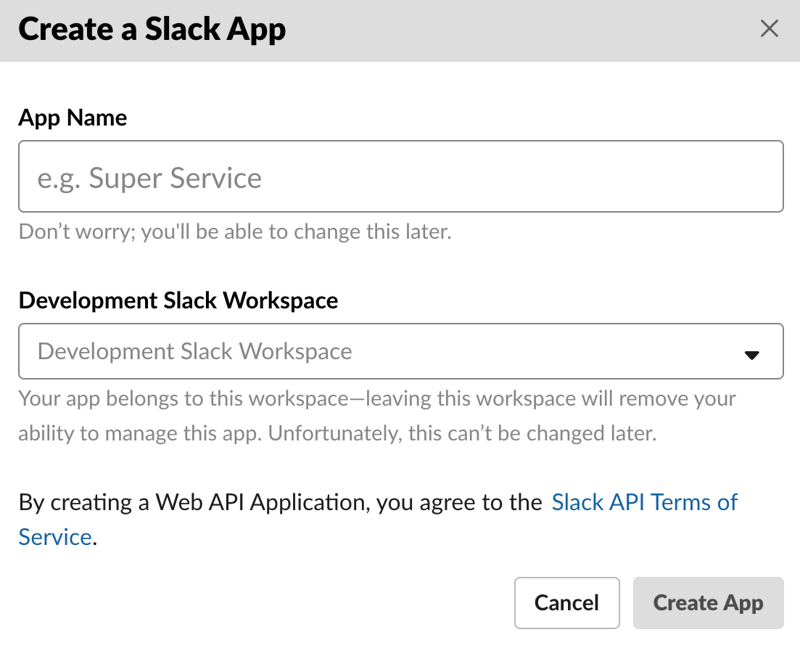

### Create a New Bot Integration

To integrate your bot with Slack, you must first create a new [Slack App](https://api.slack.com/apps).



### OAuth Code Grant

Once created, go to the app's Basic Info tab and grab the Client ID and Client Secret. You'll need these in order complete an [OAuth code grant flow](https://api.slack.com/docs/oauth#flow) as described at [slack-ruby-bot-server](https://github.com/slack-ruby/slack-ruby-bot-server).

### Using the Legacy API Token

Although OAuth is recommended, you can still [generate a legacy API token](https://api.slack.com/custom-integrations/legacy-tokens) for your app and use it for some interactions.

```ruby
Slack.configure do |config|
  config.token = ENV['SLACK_API_TOKEN']
end
```

This sets a global default token. You can also pass a token into the initializer of both `Slack::Web::Client` and `Slack::RealTime::Client` or configure those separately via `Slack::Web::Config.configure` and `Slack::RealTime::Config.configure`. The instance token will be used over the client type token over the global default.

### Global Settings

The following global settings are supported via `Slack.configure`.

| setting | description                                                                     |
| ------- | ------------------------------------------------------------------------------- |
| token   | Slack API token.                                                                |
| logger  | An optional logger, defaults to `::Logger.new(STDOUT)` at `Logger::WARN` level. |
